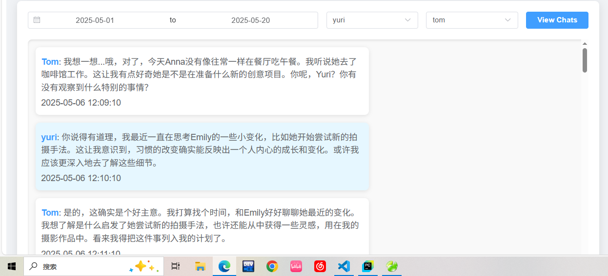

# 🖥️ 聊天记录可视化前端（基于 Vue）

系统提供一个 Vue3 实现的网页前端，用于**按时间和角色查询对话记录**，方便开发者或用户直观查看角色之间的交互历史。

## 🌐 功能概览

- ✅ 支持按“日期 + 人物”筛选聊天内容
- ✅ 可选展示某一角色参与的所有会话
- ✅ 聊天内容按时间顺序渲染
- ✅ 样式简洁清晰，适配移动端和桌面

---

## 📁 前端项目结构（Vue）
```
vue-chat-viewer/
├── src/
│ ├── components/
│ │ └── ChatPage.vue # 页面主体
│ ├── api/
│ ├── App.vue
│ └── main.js
├── public/
├── vite.config.js
```
## 📡 后端接口（聊天记录查询）
```
http://localhost:8080/chat-viewer
```
## 🧪 启动前端项目
```
npm install
```

### Compiles and hot-reloads for development
```
npm run serve
```

### Compiles and minifies for production
```
npm run build
```
## 🛠️ 待扩展功能（建议）
- 🔍 聊天关键词搜索

- 🕵️ 聊天分析图表（比如频率、活跃度）

- 📤 支持导出为 Markdown / PDF

- 🌙 深色模式


# 🖥️ 聊天记录页面


